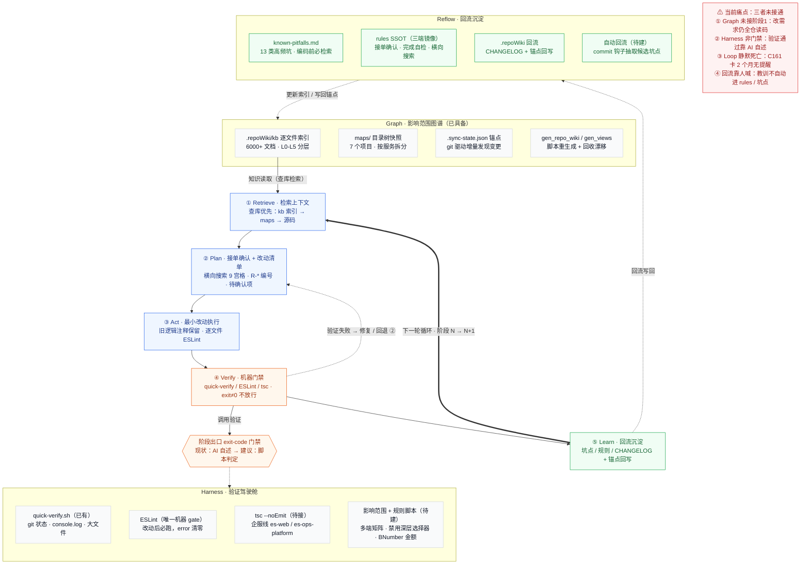

# WLYD Harness Loop Graph · 提效与质量闭环

> Graph 决定改哪里 → Harness 机器验证结果 → Loop 负责回流与回退 · 对应 `wlyd-workflow` 阶段 0-6
>
> 渲染方式：IDE 装 Mermaid 插件直接预览；也可贴入 `mermaid.live`、或放进 Obsidian 任意 `.md`。

## 图

## 图例

- **蓝色实线**：主流程 ① → ⑤（Retrieve → Plan → Act → Verify → Learn）
- **橙色实线**：控制 / 触发 —— ④ Verify 调用 Harness 门禁
- **绿色实线**：知识读取 —— Graph 汇入 ① Retrieve（先查库再读码）
- **绿色虚线**：知识写回 —— ⑤ Learn → Reflow → Graph，形成闭环
- **紫色粗箭头**：下一轮循环（阶段 N → N+1）
- **紫色虚线**：验证失败 → 修复 / 回退到 ② Plan

---

**文档版本**：v1.0
**最后更新**：2026年09月
**整理人**：王新骏
