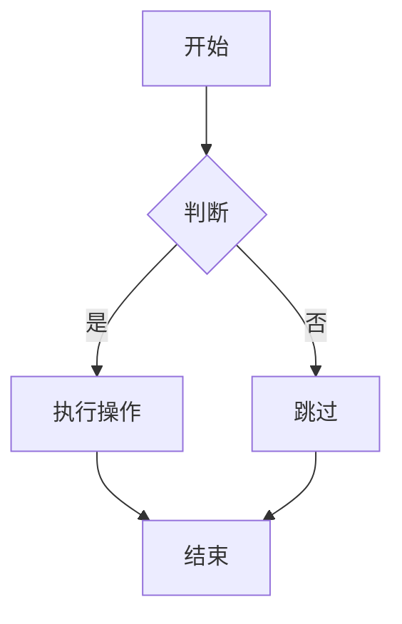

Markdown是轻量级标记语言，核心是通过简单符号实现排版，目前基础语法规则统一，高级语法为扩展规范，以下是完整语法整理：

一、基础核心语法
1. 标题

Markdown支持‌6级标题‌，通过#加空格实现，也可使用底线替代写法：

表格
Markdown写法	对应等级	替代写法
# 一级标题	一级标题	标题文字下方写任意数量=
## 二级标题	二级标题	标题文字下方写任意数量-
### 三级标题	三级标题	-
#### 四级标题	四级标题	-
##### 五级标题	五级标题	-
###### 六级标题	六级标题	-
2. 文本格式
表格
效果	Markdown写法
粗体‌	&zwnj;**加粗文本**&zwnj; 双星号包裹
斜体	*斜体文本* 单星号包裹
粗斜体‌	&zwnj;***粗斜体文本***&zwnj; 三星号包裹
删除线	~~删除文本~~ 双波浪号包裹
高亮	==高亮文本== 双等号包裹（扩展语法）
3. 段落与换行
段落：用‌空白行‌分隔不同段落，不要用空格或制表符缩进段落
换行：末尾加两个空格后回车，或直接使用<br>标签
4. 列表
无序列表

使用-/+/*任意符号加空格开头即可，示例：

markdown
- 列表项1
- 列表项2
- 列表项3

有序列表

使用数字加.加空格开头，序号自动递增，示例：

markdown
1. 第一步
2. 第二步
3. 第三步

任务列表（扩展语法）
markdown
- [ ] 未完成任务
- [x] 已完成任务


效果：

[ ] 未完成任务
[x] 已完成任务
二、常用元素语法
1. 引用

在引用内容前加>即可，支持多层嵌套：

markdown
> 一级引用
>> 二级嵌套引用
>>> 三级嵌套引用


效果：

一级引用

二级嵌套引用

2. 代码
行内代码‌：用单反引号 ` 包裹，示例：这是行内代码
代码块‌：用三个反引号包裹，可指定语言实现语法高亮：
markdown
```python
def hello():
    print("Hello World")
```

3. 链接

Markdown支持多种链接写法，最常用的是行内式：

markdown
[链接显示文字](链接地址 "可选标题")


示例：百度

自动链接写法（直接包裹网址/邮箱）：<https://www.baidu.com>{target="_blank"}

4. 图片

语法和链接类似，开头加感叹号：

markdown


5. 表格

通过|分隔单元格，-分隔表头和内容，通过冒号控制对齐方式：

markdown
| 左对齐 | 居中对齐 | 右对齐 |
| :----- | :-----: | -----: |
| 内容1  |  内容2  |  内容3 |
| 内容4  |  内容5  |  内容6 |


效果：

表格
左对齐	居中对齐	右对齐
内容1	内容2	内容3
内容4	内容5	内容6
6. 分割线

单独一行输入三个及以上-或*即可生成分割线：

markdown
---
***

三、扩展高级语法
1. 数学公式

支持LaTeX语法，行内公式用$包裹，块级公式用$$包裹：
	​

2. 脚注

在需要添加脚注的位置标记[^id]，在文档任意位置填写脚注内容：

markdown
这是一段带脚注的文字[^1]
[^1]: 这是脚注内容

3. 流程图

多数编辑器支持Mermaid流程图语法，示例：

markdown


4. 上下标
上标：OH^-^ 显示：OH^-^
下标：KBrO~3~ 显示：KBrO~3~
完整资料参考

你可以查看完整的Markdown语法手册：

Markdown基本语法 - P2HP
Markdown 语法手册(完整整理版) - 腾讯云开发者社区

需要我帮你整理一份‌可打印的Markdown常用语法速查表‌吗？便于你随时查阅使用