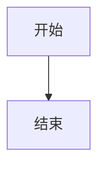
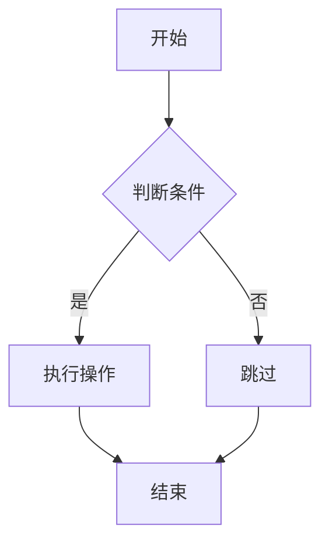
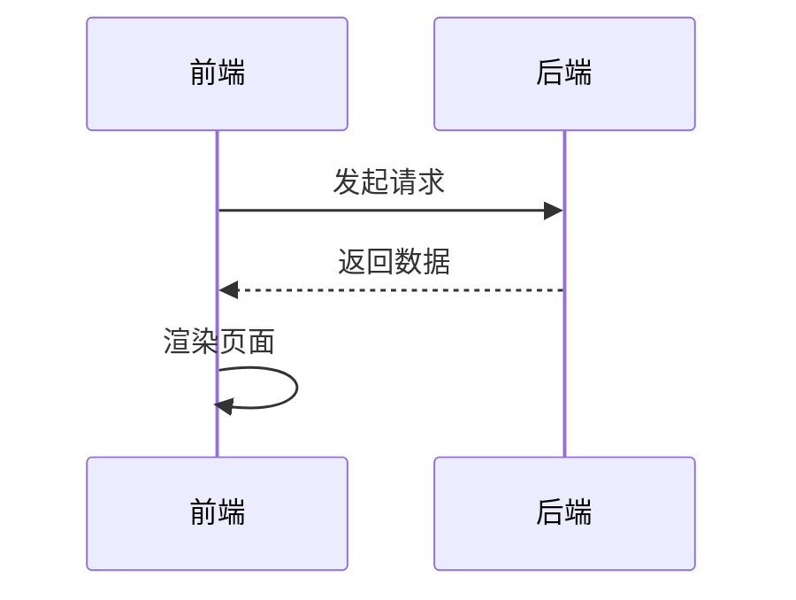
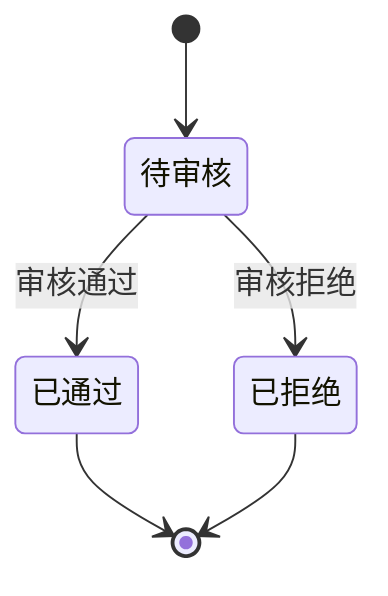
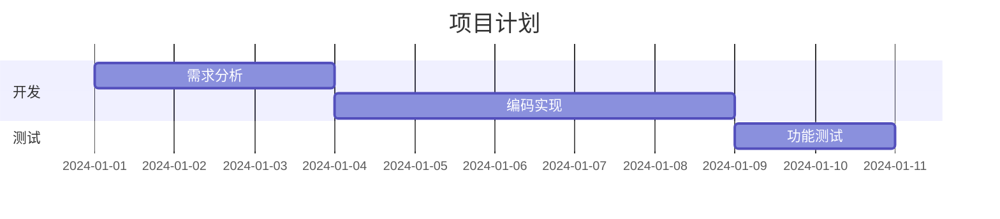
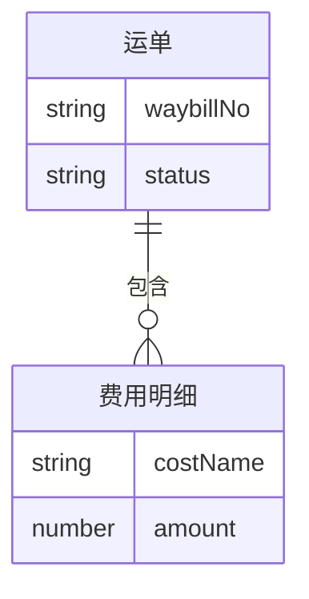
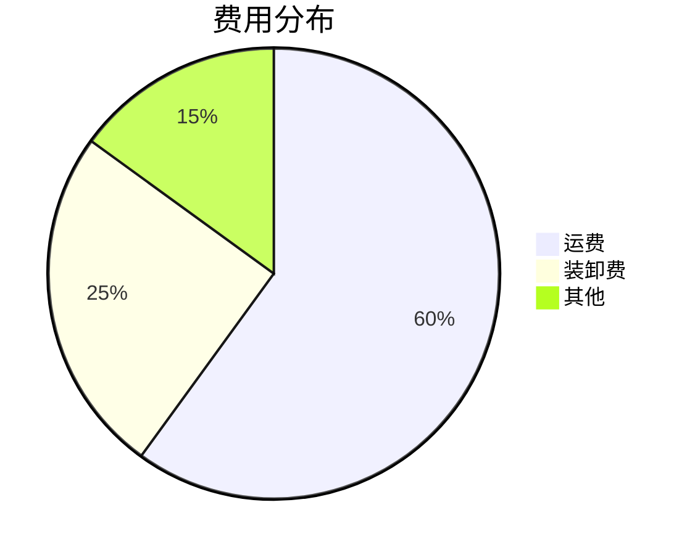

# Mermaid 快速参考

## 目录

- [基本语法](#基本语法)
- [流程图](#1-流程图flowchart)
- [时序图](#2-时序图sequence-diagram)
- [状态图](#3-状态图state-diagram)
- [甘特图](#4-甘特图gantt)
- [ER 图](#5-er-图entity-relationship)
- [饼图](#6-饼图pie)
- [使用场景](#在项目中的使用场景)
- [支持工具](#支持的工具)

---

## 基本语法

用 ` ```mermaid ` 代码块包裹图表定义：

````markdown

````

---

## 1. 流程图（Flowchart）

````markdown

````

**节点形状**：

```
A[方框]
B{菱形/判断}
C((圆形))
D>旗帜形]
```

**连线类型**：

```
A --> B        # 实线箭头
A --- B        # 实线无箭头
A -.-> B       # 虚线箭头
A -->|标签| B  # 带标签
```

**方向**：`TD`（上→下）、`LR`（左→右）、`BT`（下→上）、`RL`（右→左）

---

## 2. 时序图（Sequence Diagram）

````markdown

````

**常用语法**：

```
A ->> B: 实线箭头（有头）
A -->> B: 虚线箭头（有头）
A -x B: 实线（叉头，表示失败）
Note over A,B: 注释

loop 循环名
    A ->> B: 循环内容
end

alt 条件A
    A ->> B: 分支1
else 条件B
    A ->> B: 分支2
end
```

---

## 3. 状态图（State Diagram）

````markdown

````

---

## 4. 甘特图（Gantt）

````markdown

````

---

## 5. ER 图（Entity Relationship）

````markdown

````

**关系符号**：

```
||--||   一对一
||--o{   一对多（可选）
||--|{   一对多（必须）
```

---

## 6. 饼图（Pie）

````markdown

````

---

## 在项目中的使用场景

| 场景 | 推荐图表 |
|------|---------|
| 业务流程梳理 | `flowchart` |
| 接口交互时序 | `sequenceDiagram` |
| 运单状态流转 | `stateDiagram-v2` |
| 数据库关系 | `erDiagram` |
| 项目排期 | `gantt` |

---

## 支持的工具

| 工具 | 支持方式 |
|------|---------|
| Cursor / VS Code | 安装 [Markdown Preview Mermaid Support](https://marketplace.visualstudio.com/items?itemName=bierner.markdown-mermaid) 插件 |
| Notion | 原生支持 `/mermaid` 代码块 |
| GitHub / GitLab | Markdown 文件中原生渲染 |
| 在线编辑器 | [mermaid.live](https://mermaid.live) |

---

**文档版本**: v1.0
**最后更新**: 2026年07月
**整理人**: 王新骏
